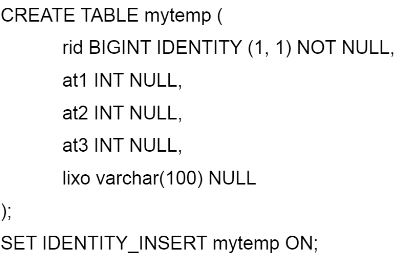

# BD: Guião 8


## ​8.1. Complete a seguinte tabela.
Complete the following table.

| #    | Query                                                                                                      | Rows  | Cost  | Pag. Reads | Time (ms) | Index used | Index Op.            | Discussion |
| :--- | :--------------------------------------------------------------------------------------------------------- | :---- | :---- | :--------- | :-------- | :--------- | :------------------- | :--------- |
| 1    | SELECT * from Production.WorkOrder                                                                         | 72591 | 0.484 | 530        | 30        | WorkOrderID(PK) | Clustered Index Scan |            |
| 2    | SELECT * from Production.WorkOrder where WorkOrderID=1234                                                  | 1     | 0.003 |  20        | 0         | WorkOrderID(PK) | Clustered Index Seek |            |
| 3.1  | SELECT * FROM Production.WorkOrder WHERE WorkOrderID between 10000 and 10010                               | 11    | 0.003 | 20         | 0         | WorkOrderID(PK) | Clustered Index Seek |            |
| 3.2  | SELECT * FROM Production.WorkOrder WHERE WorkOrderID between 1 and 72591                                   | 72591 | 0.4   |  548       | 32        | WorkOrderID(PK) | Clustered Index Seek |            |
| 4    | SELECT * FROM Production.WorkOrder WHERE StartDate = '2007-06-25'                                          | 72591 | 0.39  |1146        | 20        | WorkOrderID(PK) | Clustered Index Scan |            |
| 5    | SELECT * FROM Production.WorkOrder WHERE ProductID = 757                                                   | 9     | 0.0032|   238      | 2         | ProductID       | Key Lookup           |            |
| 6.1  | SELECT WorkOrderID, StartDate FROM Production.WorkOrder WHERE ProductID = 757                              | 9     | 0.034 |  44        | 3         | ProductID Covered (StartDate) | Key Lookup          |            |
| 6.2  | SELECT WorkOrderID, StartDate FROM Production.WorkOrder WHERE ProductID = 945                              |1105   |0.39   |748         | 17        | ProductID Covered (StartDate) |  Clustered Index Scan |            |
| 6.3  | SELECT WorkOrderID FROM Production.WorkOrder WHERE ProductID = 945 AND StartDate = '2006-01-04'            |72591  |0.47   |750         | 17        | ProductID Covered (StartDate) |  Clustered Index Scan |            |
| 7    | SELECT WorkOrderID, StartDate FROM Production.WorkOrder WHERE ProductID = 945 AND StartDate = '2006-01-04' |72591  | 0.47 |750          |15         |ProductID and StartDate |Clustered Index Scan|                      |
| 8    | SELECT WorkOrderID, StartDate FROM Production.WorkOrder WHERE ProductID = 945 AND StartDate = '2006-01-04' |72591  | 0.47 |750          |15         |Composite (ProductID, StartDate) |Clustered Index Scan |            |

## ​8.2.

### a)

```
Foi definida na base de dados.
```

### b)

```
98.95%
```

### c)

```
Fillfactor 65:
Tempo de inserção: 45 segundos

Fillfactor 80:
Tempo de inserção: 41 segundos

Fillfactor 90:
Tempo de inserção: 48 segunos
```

### d)



```
Novo tempo de inserção: 45 segundos
```

### e)

```
Sem index: 
Tempo : 1 minuto e 30 segundos

Com index: 
Tempo: 1 minuto e 46 segundos

Ao inserir com todos os indexes a performance piora.
```

## ​8.3.

```
i: Employee(SSN) -> Unique Clustered
ii: Employee(Fname,Lname) -> NonClustered
iii: Employee(Dno) -> NonClustered
Department(Dnumber) -> Unique Clustered
iv: Works_on(Essn,Pno) -> Unique Clustered
Project(Pnumber) -> NonClustered
```
